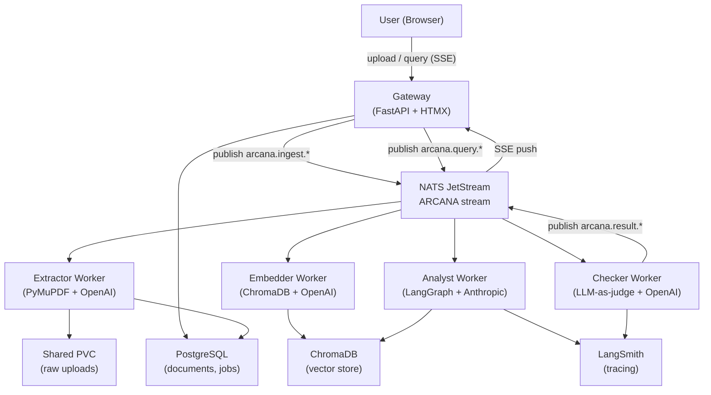

<p align="center">
  <h1 align="center">Arcana</h1>
  <p align="center">
    Multi-agent research analyst pipeline
    <br />
    <em>Upload documents. Ask questions. Get structured analysis with LLM-as-judge quality checks.</em>
  </p>
</p>

<p align="center">
  
  
  
  
  
  
  
</p>

---

## Architecture



## Quickstart

### Local Development (Docker Compose + uv)

```bash
# Start infrastructure
docker compose up -d

# Install Python deps
uv sync

# Run database migrations (SQLite for local dev)
uv run python -m arcana.store.migrations

# Start the gateway
uv run uvicorn arcana.gateway.app:create_app --factory --reload --port 8000

# In separate terminals, start each worker
ARCANA_WORKER_TYPE=extractor uv run python -m arcana.workers
ARCANA_WORKER_TYPE=embedder  uv run python -m arcana.workers
ARCANA_WORKER_TYPE=analyst   uv run python -m arcana.workers
ARCANA_WORKER_TYPE=checker   uv run python -m arcana.workers
```

Required environment variables (copy from `.env.example` if present):

```
OPENAI_API_KEY=sk-...
ANTHROPIC_API_KEY=sk-ant-...
LANGSMITH_API_KEY=ls__...
ARCANA_NATS_URL=nats://localhost:4222
ARCANA_CHROMA_HOST=localhost
```

Visit http://localhost:8000 for the dashboard.

### Kubernetes Deployment

```bash
# Fill in real values first — never commit secrets
$EDITOR k8s/secrets.yaml

# Apply to cluster
kubectl apply -k k8s/

# Wait for postgres to be ready, then run the NATS stream init job
kubectl -n arcana wait --for=condition=complete job/arcana-nats-stream-init --timeout=60s

# Check all pods
kubectl -n arcana get pods
```

Build and push the image before deploying:

```bash
docker build -t your-registry/arcana:latest .
docker push your-registry/arcana:latest
# Update image references in k8s/gateway.yaml and k8s/workers.yaml
```

## Tests

```bash
# Full test suite
uv run pytest

# Skip slow / integration tests
uv run pytest -m "not slow and not integration"

# With coverage
uv run pytest --cov=src/arcana --cov-report=term-missing
```

## Design Decisions

**Why LangGraph.** The research pipeline has conditional branching — if the checker rejects an analysis, the graph loops back to the analyst with the critique attached. LangGraph's explicit node/edge model makes this control flow inspectable and resumable. A linear chain cannot express rejection-retry without bespoke orchestration code; LangGraph gives us that for free along with built-in LangSmith tracing at every node boundary.

**Why NATS JetStream.** The four workers (extractor, embedder, analyst, checker) are independently scalable and must survive gateway restarts without losing in-flight jobs. NATS JetStream provides durable, at-least-once delivery with consumer groups, a 72-hour retention window for replay, and a dead-letter queue for poison messages — all without operating a full message broker cluster. The `nats-py` client is async-native and fits cleanly into the asyncio worker loop.

**Why multi-provider (OpenAI + Anthropic).** Each provider has a comparative advantage at a different stage. OpenAI's embedding models (`text-embedding-3-small`) give best-in-class vector quality for the embedder. Anthropic's Claude is used for the analyst where extended reasoning and instruction-following depth matter most. OpenAI's cheaper models handle the checker's structured rubric evaluation. Decoupling providers by worker means we can swap any one without touching the others, and cost is right-sized per stage.

**Why Jinja2 + HTMX.** Server-side rendering keeps the frontend a thin layer: no React build pipeline, no JavaScript bundler, no state management library. HTMX attributes on standard HTML elements handle SSE streams, partial page swaps, and form submissions. The dashboard is a single Jinja2 template that renders correctly without JavaScript and progressively enhances with it. This reduces frontend surface area to near zero, which matters for a pipeline tool where the UI is a means, not the product.

## Production Considerations

- Replace `secrets.yaml` placeholder values with a proper secret management solution (External Secrets Operator + Vault, or Sealed Secrets) before any real deployment.
- The shared uploads PVC uses `ReadWriteMany` — ensure your storage class supports RWX (e.g., NFS, Longhorn with RWX enabled, or a cloud-native RWX volume type).
- The NATS instance reused from `halo-fleet` namespace (`nats.halo-fleet:4222`) means arcana is coupled to the halo-fleet NATS cluster; evaluate whether a dedicated NATS instance is warranted at scale.
- Add a `HorizontalPodAutoscaler` for the extractor and embedder workers — ingestion throughput is bursty and these are the first bottleneck.
- The gateway's SSE connections are long-lived; configure an appropriate `terminationGracePeriodSeconds` (60s+) so in-flight analysis streams are not severed on rolling deploys.
- LangSmith tracing adds latency overhead in the critical path; gate it behind `LANGCHAIN_TRACING_V2=true` and disable in latency-sensitive environments.
- Checker worker is the quality gate — a failing checker should increment a metric and alert, not silently drop the result. Wire `ARCANA_CHECKER_FAIL_METRIC` to your observability stack.
- Run `uv lock --upgrade` periodically; `langgraph`, `langchain-*`, and `chromadb` all move fast and accumulate breaking changes across minor versions.
